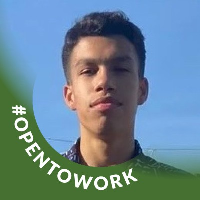

# RockySoulUp — Frontend React

<p align="center">
  
</p>

Plataforma **gamificada** de sustentabilidade que transforma ações ecológicas do dia a dia em **pontos, níveis, selos, mini-jogos e recompensas reais** — com integração a um **avatar inteligente** (o assistente **RockySoul**) que guia a jornada do usuário dentro do site.

Desenvolvida como **SPA (Single Page Application)** com **React + Vite + TypeScript + TailwindCSS**.

> **Demonstração visual** — a tela inicial do projeto (Home) com a ilha flutuante e o assistente RockySoul:

<p align="center">
  
</p>

---

## Gamificação com Avatar Integrado

O coração do projeto é a combinação de **gamificação** com um **avatar/assistente virtual** que media toda a experiência dentro do site:

- **Avatar RockySoul** — assistente virtual integrado ao site. Ele conversa em português, entende comandos de linguagem natural ("reciclei", "usei bicicleta", "economizei água") e executa ações reais na aplicação: registra ações, mostra saldo/nível, sugere missões, ensina curiosidades e até resgata recompensas para o usuário.
- **Pontos** — cada ação sustentável gera pontos que alimentam o avatar e o perfil do usuário.
- **Níveis de evolução** — Semente → Broto → Árvore → Expert, com progresso visual em anel de progresso e barra de XP.
- **Selos desbloqueáveis** — conquistas automáticas ao acumular pontos.
- **Mini-jogo "Separe o Lixo"** — gamificação extra por meio de um jogo de separação de recicláveis (3 fases, vidas, combos e recordes).
- **Desafio do Dia** — missão diária com bônus por streak (dias seguidos).
- **Ranking global** — posição do usuário entre os participantes.
- **Recompensas reais** — troca de pontos por cupons, descontos e brindes.
- **Impacto ambiental** — métricas de CO₂ evitado e árvores equivalentes.

O assistente **RockySoul** funciona como um "avatar" que representa o site: ele interage com o usuário, conhece o progresso dele (via estado global) e o acompanha em cada página — reforçando o laço entre gamificação e a interface.

---

## Tecnologias Utilizadas

- **React 19** — Interface e componentização
- **Vite** — Build, dev server e desempenho
- **TypeScript** — Tipagem estática obrigatória
- **TailwindCSS 4** — Estilização utilitária de toda a interface
- **React Router DOM 7** — Navegação SPA com rotas estáticas e dinâmicas
- **Oxlint** — Linter

> Sem frameworks de UI prontos (Bootstrap, Material UI, Chakra, jQuery etc.) e sem bibliotecas externas de requisição (como Axios). Toda a interface, gamificação e o chat do avatar são **100% código próprio** em React + Vite + TypeScript.

---

## Páginas e Rotas

| Rota | Página | Tipo |
| --- | --- | --- |
| `/` | Home | Estática |
| `/dashboard` | Dashboard (gamificação + avatar) | Estática |
| `/solucao` | Solução do Projeto | Estática |
| `/recompensas` | Recompensas | Estática |
| `/recompensas/:id` | Detalhe da Recompensa | **Dinâmica (useParams)** |
| `/sobre` | Sobre | Estática |
| `/faq` | FAQ | Estática |
| `/integrantes` | Equipe | Estática |
| `/contato` | Contato | Estática |

---

## Estrutura de Pastas

```
rockysoul-react/
├── public/
│   ├── icons/          # Icones SVG da aplicacao
│   └── imagens/        # Logo, ilha flutuante e fotos dos integrantes
├── src/
│   ├── components/     # Componentes reutilizaveis
│   │   ├── Header.tsx          # Navegacao principal + menu do usuario
│   │   ├── Footer.tsx          # Rodape do site
│   │   ├── Chat.tsx            # Avatar RockySoul (assistente virtual)
│   │   ├── Toast.tsx           # Sistema de notificacoes
│   │   ├── LoginModal.tsx      # Cadastro/entrada com validacao propria
│   │   ├── VerificarModal.tsx  # Verificacao de acao (foto/GPS/timer/declaracao)
│   │   ├── ResgatarModal.tsx   # Confirmacao de resgate de recompensa
│   │   └── MiniJogoSeparacao.tsx # Mini-jogo de separacao de lixo
│   ├── pages/          # Paginas da aplicacao (componentes React)
│   │   ├── Home.tsx
│   │   ├── Dashboard.tsx
│   │   ├── Solucao.tsx
│   │   ├── Recompensas.tsx
│   │   ├── RecompensaDetalhe.tsx  # Rota dinamica com useParams
│   │   ├── Sobre.tsx
│   │   ├── Faq.tsx
│   │   ├── Integrantes.tsx
│   │   └── Contato.tsx
│   ├── context/        # Estado global (DataContext, ChatContext)
│   ├── hooks/          # Hooks personalizados (useLocalStorage)
│   ├── data/           # Dados e constantes (missoes, selos, niveis, recompensas, integrantes)
│   ├── types/          # Interfaces TypeScript
│   ├── layouts/        # LayoutPrincipal (Header + Outlet + Footer)
│   ├── utils/          # Formatacao e validacao de formulario
│   ├── App.tsx         # Rotas e layout principal
│   ├── main.tsx        # Ponto de entrada
│   └── index.css       # Tailwind + tema (cores, fontes) + animacoes
```

---

## Sistema de Gamificação

### Níveis e Selos

| Nível | Faixa de Pontos | Selo correspondente |
| --- | --- | --- |
| Semente | 0 – 99 | Semente (100 pts) |
| Broto | 100 – 299 | Broto (300 pts) |
| Árvore | 300 – 999 | Árvore (600 pts) |
| Expert | 1000+ | Expert (1000 pts) |

### Missoes (ações sustentáveis)

Reciclagem, Transporte Sustentável, Economia de Energia, Economia de Água, Bicicleta, Plantio, Banho Rápido (timer), Compostagem, Consumo Consciente, Garrafa Reutilizável, Compartilhar Dicas e Sacola Reutilizável — cada uma com formatação de **comprovação** (foto, foto+GPS, timer ou declaração).

### Recompensas

Descontos de energia/água, passes de transporte, mudas e adoção de árvores, cupons e kits sustentáveis — resgatáveis conforme o saldo de pontos.

---

## Avatar RockySoul (Assistente Virtual)

O **Chat.tsx** implementa o avatar inteligente com:

- **Detecção de intenção** via palavras-chave em português (saudação, pontos, nível, dica, recompensa, registro de ação, curiosidade, despedida etc.).
- **Fluxos guiados** (registrar ação e resgatar recompensa) com entrada numérica.
- **Integração com o estado global** (`DataContext`): o avatar acessa pontos, nível, histórico e realiza ações reais (adicionar/subtrair pontos, registrar resgates).
- **Sugestões rápidas** e **curiosidades sustentáveis**.
- Teaser inicial que convida o usuário a conversar com o assistente (`ChatContext`).

---

## Como Usar

### 1. Instalação e execução

```bash
# Clone o repositório
git clone https://github.com/igorodriguesd/rockysoul-react.git
cd rockysoul-react

# Instale as dependencias
npm install

# Inicie o servidor de desenvolvimento
npm run dev

# Gere a build de producao
npm run build

# Rode o linter
npm run lint
```

Acesse `http://localhost:5173` no navegador (porta padrão do Vite).

### 2. Uso da plataforma

1. Na **Home**, clique em **"Começar Agora"** e informe seu nome/email.
2. No **Dashboard**, registre uma ação sustentável (reciclar, economizar energia/água, usar transporte etc.), envie a foto como comprovação e acumule **pontos**.
3. Complete o **Desafio do Dia** para ganhar bônus e mantenha o **streak** (dias seguidos).
4. Jogue o **Mini-jogo "Separe o Lixo"** para converter a pontuação em pontos extras.
5. Evolua nos **níveis** (Semente → Broto → Árvore → Expert), desbloqueie **selos** e veja sua posição no **ranking**.
6. Troque seus pontos por **recompensas reais** na página Recompensas.
7. Converse com o **avatar RockySoul** (canto inferior direito) — ele registra ações, mostra saldo e resgata recompensas por voz/texto.

---

## Responsividade

- **Mobile** — até 480px
- **Tablet** — 768px
- **Desktop** — 992px+

---

## Imagens e Ícones do Projeto

O projeto usa **ícones SVG proprietários** em `/public/icons` (reciclagem, transporte, energia, água, bicicleta, árvore, banho, semente, broto, troféu, folha, check e mais) e imagens em `/public/imagens` (logo da RockySoulUp, ilha flutuante da Home e fotos dos integrantes).

Alguns dos ícones que representam as missões:

<p align="center">
  
  
  
  
  
  
  
  
  
</p>

---

## Dados Persistidos

Todas as informações do usuário são salvas no **localStorage**, via hook `useLocalStorage`:

- Pontos totais e diários
- Missões completadas
- Histórico de ações
- Selos desbloqueados
- Resgates realizados
- Dados do usuário (nome/email)
- Streak (dias seguidos) e desafio do dia
- Recordes do mini-jogo

---

## Repositório

- **GitHub:** https://github.com/igorodriguesd/rockysoul-react

---

## Integrantes

| Foto | Nome | RM | Turma | GitHub | LinkedIn |
| --- | --- | --- | --- | --- | --- |
|  | Igor Rodrigues de Santana | RM570651 | 1TDSPK | [igorodriguesd](https://github.com/igorodriguesd) | [LinkedIn](https://linkedin.com/in/igor-rodrigues-135aa72b2) |
|  | Diego Gomes Goncalves de Lima | RM570335 | 1TDSPK | [dgxls](https://github.com/dgxls) | [LinkedIn](https://www.linkedin.com/in/diego-gomes-65339b408/) |
|  | Miguel Silva | RM572019 | 1TDSPK | [miguelsilva71](https://github.com/miguelsilva71) | [LinkedIn](https://www.linkedin.com/in/miguel-silva-0a20073a9/) |
|  | Rafael Santos Mendonca Costa | RM572368 | 1TDSPK | [RafaelSantos56](https://github.com/RafaelSantos56) | [LinkedIn](https://www.linkedin.com/in/rafael-santos-b09bba237/) |

**Turma 1TDSPK — FIAP 2026**

---

## Contato

Para entrar em contato com a equipe RockySoulUp:

- **Formulário do site:** acesse a rota `/contato` da aplicação e envie uma mensagem.
- **GitHub do repositório:** abra uma issue ou PR em https://github.com/igorodriguesd/rockysoul-react
- **LinkedIn dos integrantes:** utilize os links da tabela acima para falar diretamente com cada membro da equipe.

| Integrante | LinkedIn |
| --- | --- |
| Igor Rodrigues de Santana | [linkedin.com/in/igor-rodrigues-135aa72b2](https://linkedin.com/in/igor-rodrigues-135aa72b2) |
| Diego Gomes Goncalves de Lima | [LinkedIn](https://www.linkedin.com/in/diego-gomes-65339b408/) |
| Miguel Silva | [LinkedIn](https://www.linkedin.com/in/miguel-silva-0a20073a9/) |
| Rafael Santos Mendonca Costa | [LinkedIn](https://www.linkedin.com/in/rafael-santos-b09bba237/) |
