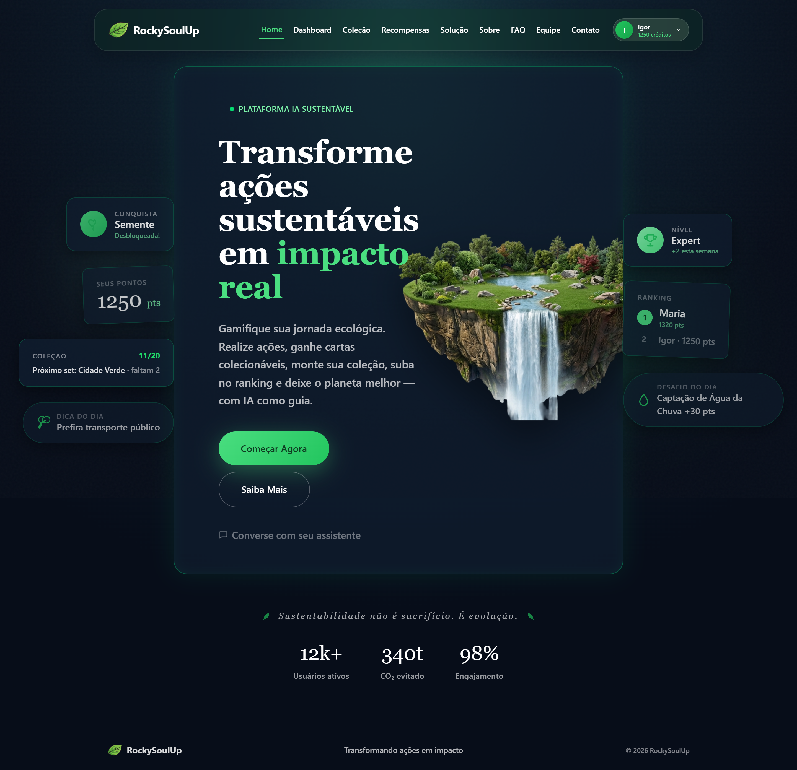
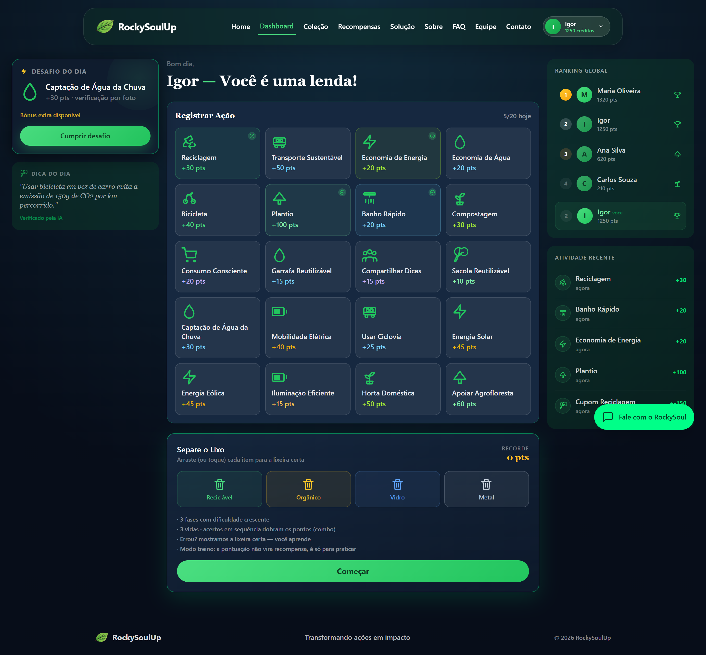
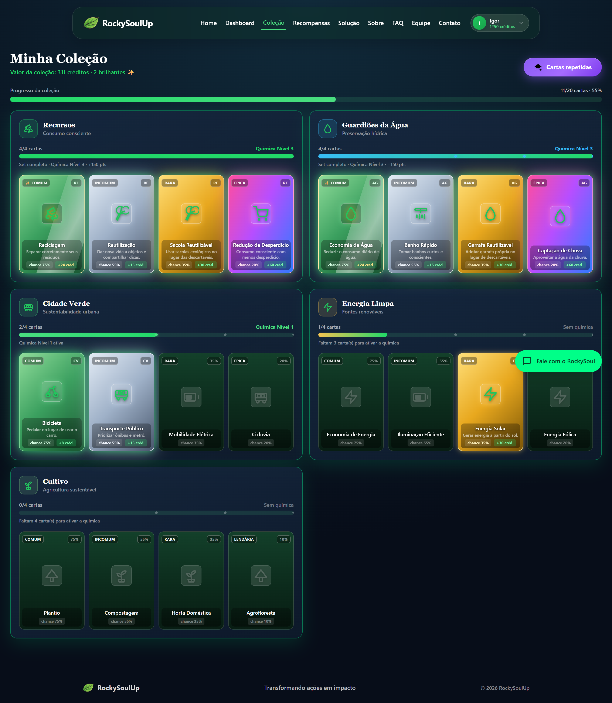
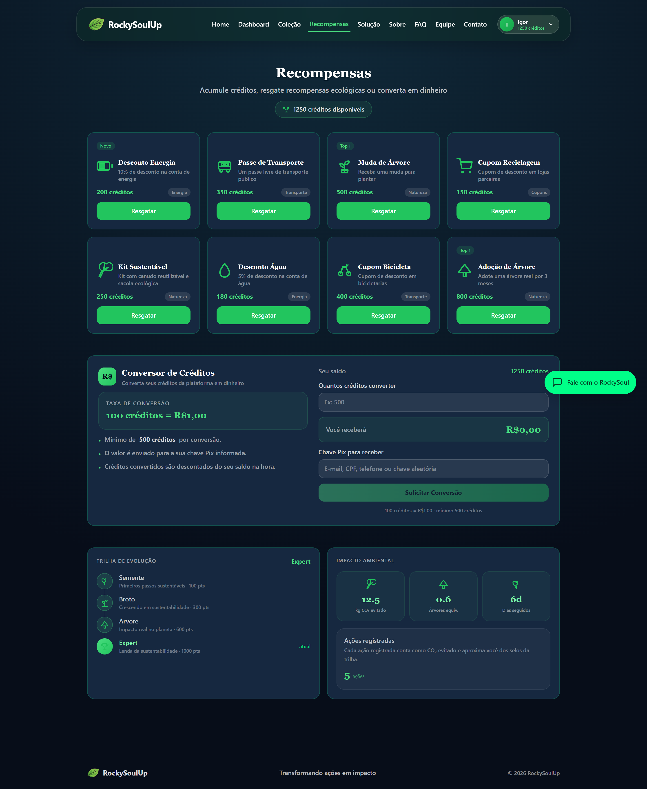

# RockySoulUp — Frontend React

<p align="center">
  
</p>

Plataforma **gamificada** de sustentabilidade que transforma ações ecológicas do dia a dia em **pontos, níveis, selos, cartinhas colecionáveis, mini-jogos e recompensas reais** — com integração a um **avatar inteligente** (o assistente **RockySoul**) que guia a jornada do usuário dentro do site.

Desenvolvida como **SPA (Single Page Application)** com **React + Vite + TypeScript + TailwindCSS**.

---

## Imagens e Ícones do Projeto

As principais telas da plataforma (Home, Dashboard, Coleção e Recompensas):

<table align="center">
  <tr>
    <td align="center">
      <br>
      <sub><strong>Home</strong> — vitrine e o assistente RockySoul</sub>
    </td>
    <td align="center">
      <br>
      <sub><strong>Dashboard</strong> — pontos, nível, selos e desafio do dia</sub>
    </td>
  </tr>
  <tr>
    <td align="center">
      <br>
      <sub><strong>Coleção</strong> — cartinhas, sets e Fábrica de Cartas</sub>
    </td>
    <td align="center">
      <br>
      <sub><strong>Recompensas</strong> — troca de pontos por prêmios</sub>
    </td>
  </tr>
</table>

---

## Gamificação com Avatar Integrado

O coração do projeto é a combinação de **gamificação** com um **avatar/assistente virtual** que media toda a experiência dentro do site:

- **Avatar RockySoul** — assistente virtual integrado ao site. Ele conversa em português, entende comandos de linguagem natural ("reciclei", "usei bicicleta", "economizei água") e executa ações reais na aplicação: registra ações, mostra saldo/nível, sugere missões, ensina curiosidades e até resgata recompensas para o usuário.
- **Pontos** — cada ação sustentável gera pontos que alimentam o avatar e o perfil do usuário.
- **Níveis de evolução** — Semente → Broto → Árvore → Expert, com progresso visual em anel de progresso e barra de XP.
- **Selos desbloqueáveis** — conquistas automáticas ao acumular pontos.
- **Coleção de Cartinhas** — ao concluir missões, uma **roleta** sorteia **cartinhas colecionáveis** de 5 sets temáticos e 5 raridades (Comum a Lendária), com chance de versão **brilhante** ✨. Cartas repetidas viram **fragmentos** para a **Fábrica de Cartas**, e completar um set (4/4) ativa a **química** com bônus de +150 créditos.
- **Mini-jogo "Separe o Lixo"** — gamificação extra por meio de um jogo de separação de recicláveis (3 fases, vidas, combos e recordes), em modo treino: a pontuação não vira recompensa, serve para praticar e se divertir.
- **Desafio do Dia** — missão diária com bônus por streak (dias seguidos).
- **Ranking global** — posição do usuário entre os participantes da comunidade.
- **Recompensas reais** — troca de pontos por cupons, descontos e brindes na página Recompensas.
- **Conversor de créditos em dinheiro** — converte créditos em reais que são enviados pela sua **chave Pix** (100 créditos = R$ 1,00, mínimo de 500 créditos).
- **Impacto ambiental** — métricas de CO₂ evitado e árvores equivalentes.

O assistente **RockySoul** funciona como um "avatar" que representa o site: ele interage com o usuário, conhece o progresso dele (via estado global) e o acompanha em cada página — reforçando o laço entre gamificação e a interface.

---

## Tecnologias Utilizadas

- **React 19** — Interface e componentização
- **Vite** — Build, dev server e desempenho
- **TypeScript** — Tipagem estática obrigatória
- **TailwindCSS 4** — Estilização utilitária de toda a interface
- **React Router DOM 7** — Navegação SPA com rotas estáticas e dinâmicas
- **Oxlint** — Linter

> Sem frameworks de UI prontos (Bootstrap, Material UI, Chakra, jQuery etc.) e sem bibliotecas externas de requisição (como Axios). Toda a interface, gamificação e o chat do avatar são **100% código próprio** em React + Vite + TypeScript.

---

## Páginas e Rotas

| Rota | Página | Tipo |
| --- | --- | --- |
| `/` | Home | Estática |
| `/dashboard` | Dashboard (gamificação + avatar) | Estática |
| `/colecao` | Coleção de Cartinhas + Fábrica de Cartas | Estática |
| `/solucao` | Solução do Projeto | Estática |
| `/recompensas` | Recompensas | Estática |
| `/recompensas/:id` | Detalhe da Recompensa | **Dinâmica (useParams)** |
| `/sobre` | Sobre | Estática |
| `/faq` | FAQ | Estática |
| `/integrantes` | Equipe | Estática |
| `/contato` | Contato | Estática |

---

## Estrutura de Pastas

```
rockysoul-react/
├── public/
│   ├── icons/                  # Icones SVG da aplicacao
│   └── imagens/                # Logo, ilha, prints das telas e fotos dos integrantes
├── src/
│   ├── components/             # Componentes reutilizaveis
│   │   ├── Header.tsx          # Navegacao principal + menu do usuario
│   │   ├── Footer.tsx          # Rodape do site
│   │   ├── Chat.tsx            # Avatar RockySoul (assistente virtual)
│   │   ├── Toast.tsx           # Sistema de notificacoes
│   │   ├── LoginModal.tsx      # Cadastro/entrada com validacao propria
│   │   ├── VerificarModal.tsx  # Verificacao de acao (foto/GPS/timer/declaracao)
│   │   ├── ResgatarModal.tsx   # Confirmacao de resgate de recompensa
│   │   ├── MiniJogoSeparacao.tsx # Mini-jogo de separacao de lixo
│   │   ├── CardItem.tsx        # Cartinha colecionavel (raridade, foil, hover)
│   │   ├── NovaCarta.tsx       # Cartinha revelada depois da roleta
│   │   ├── RoletaDrop.tsx      # Roleta de sorteio da cartinha
│   │   ├── SetColecao.tsx      # Set de cartinhas com quimica
│   │   ├── SetProgress.tsx     # Barra de progresso do set
│   │   └── CollectionChip.tsx  # Chip da colecao (header/dashboard)
│   ├── pages/                  # Paginas da aplicacao (componentes React)
│   │   ├── Home.tsx
│   │   ├── Dashboard.tsx
│   │   ├── Colecao.tsx         # Colecao de cartinhas + Fabrica de Cartas
│   │   ├── Solucao.tsx
│   │   ├── Recompensas.tsx
│   │   ├── RecompensaDetalhe.tsx  # Rota dinamica com useParams
│   │   ├── Sobre.tsx
│   │   ├── Faq.tsx
│   │   ├── Integrantes.tsx
│   │   └── Contato.tsx
│   ├── context/        # Estado global (DataContext, CollectionContext, ChatContext)
│   ├── hooks/          # Hooks personalizados (useLocalStorage)
│   ├── data/           # Dados e constantes (missoes, selos, niveis, recompensas, cartas, integrantes)
│   ├── types/          # Interfaces TypeScript
│   ├── layouts/        # LayoutPrincipal (Header + Outlet + Footer)
│   ├── utils/          # Formatacao e validacao de formulario
│   ├── App.tsx         # Rotas e layout principal
│   ├── main.tsx        # Ponto de entrada
│   └── index.css       # Tailwind + tema (cores, fontes) + animacoes
```

---

## Sistema de Gamificação

### Níveis e Selos

| Nível | Faixa de Pontos | Selo correspondente |
| --- | --- | --- |
| Semente | 0 – 99 | Semente (100 pts) |
| Broto | 100 – 299 | Broto (300 pts) |
| Árvore | 300 – 999 | Árvore (600 pts) |
| Expert | 1000+ | Expert (1000 pts) |

### Missoes (ações sustentáveis)

São **20 missões** — Reciclagem, Transporte Sustentável, Economia de Energia, Economia de Água, Bicicleta, Plantio, Banho Rápido (timer), Compostagem, Consumo Consciente, Garrafa Reutilizável, Compartilhar Dicas, Sacola Reutilizável, Captação de Água da Chuva, Mobilidade Elétrica, Usar Ciclovia, Energia Solar, Energia Eólica, Iluminação Eficiente, Horta Doméstica e Apoiar Agrofloresta — cada uma com pontuação própria e formato de **comprovação** (foto, foto+GPS, timer ou declaração).

### Coleção de Cartinhas

Ao concluir uma missão, o Dashboard aciona a **roleta** e pode premiar você com uma cartinha. São **20 cartinhas** divididas em **5 sets temáticos** — Recursos, Guardiões da Água, Cidade Verde, Energia Limpa e Cultivo — com **Química** de set: complete 4 cartinhas de um set para ganhar **+150 créditos**. Cada raridade tem sua própria chance de ser sorteada e rende fragmentos diferentes quando repetida:

| Raridade | Chance de encontrar | Fragmentos por repetida |
| --- | --- | --- |
| Comum | 75% | +3 |
| Incomum | 55% | +5 |
| Rara | 35% | +10 |
| Épica | 20% | +20 |
| Lendária | 10% | +40 |

Há ainda **8% de chance** de a cartinha vir na versão **brilhante** (✨). Na **Fábrica de Cartas** (dentro do popup de "Cartas repetidas" na página Coleção), fragmentos são usados para montar cartinhas que faltam — custo de 10/16/32/70/140 fragmentos por raridade (Comum/Incomum/Rara/Épica/Lendária).

### Recompensas

**8 recompensas** — descontos de energia/água, passes de transporte, mudas, adoção de árvores, cupons e kits sustentáveis — resgatáveis conforme o saldo de créditos. A página também traz o **Conversor de Créditos** (100 créditos = R$ 1,00, mínimo de 500, pagamento via **chave Pix**) e os painéis de **Trilha de Evolução** e **Impacto Ambiental** (CO₂ evitado e árvores equivalentes).

### Ranking global

Além do seu saldo, o app simula a comunidade com o **Ranking global** (Maria Oliveira, Ana Silva, Carlos Souza e Pedro Santos) para posicionar o usuário entre os participantes.

---

## Avatar RockySoul (Assistente Virtual)

O **Chat.tsx** implementa o avatar inteligente com:

- **Detecção de intenção** via palavras-chave em português (saudação, pontos, nível, dica, recompensa, registro de ação, curiosidade, despedida etc.).
- **Fluxos guiados** (registrar ação, converter créditos e resgatar recompensa) com entrada numérica.
- **Integração com o estado global** (`DataContext` e `CollectionContext`): o avatar acessa pontos, nível, histórico e coleção de cartinhas, e realiza ações reais (adicionar/subtrair pontos, registrar resgates).
- **Sugestões rápidas** e **curiosidades sustentáveis**.
- Teaser inicial que convida o usuário a conversar com o assistente (`ChatContext`).

---

## Como Usar

### 1. Instalação e execução

```bash
# Clone o repositório
git clone https://github.com/igorodriguesd/rockysoul-react.git
cd rockysoul-react

# Instale as dependencias
npm install

# Inicie o servidor de desenvolvimento
npm run dev

# Gere a build de producao
npm run build

# Rode o linter
npm run lint
```

Acesse `http://localhost:5173` no navegador (porta padrão do Vite).

### 2. Uso da plataforma

1. Na **Home**, clique em **"Começar Agora"** e informe seu nome/email.
2. No **Dashboard**, registre uma ação sustentável (reciclar, economizar energia/água, usar transporte etc.), envie a foto como comprovação e acumule **pontos**.
3. Cada missão concluída aciona a **roleta**: conquiste **cartinhas colecionáveis** e monte sua coleção na página **Coleção** — completando sets você ativa a **química** (+150 créditos).
4. Complete o **Desafio do Dia** para ganhar bônus e mantenha o **streak** (dias seguidos).
5. Treine no **Mini-jogo "Separe o Lixo"** para praticar a separação de recicláveis e bater seus recordes (modo treino, sem valer recompensa).
6. Evolua nos **níveis** (Semente → Broto → Árvore → Expert), desbloqueie **selos** e veja sua posição no **ranking**.
7. Troque seus créditos por **recompensas reais** ou **converta em dinheiro via Pix** na página Recompensas.
8. Converse com o **avatar RockySoul** (canto inferior direito) — ele registra ações, mostra saldo e resgata recompensas por voz/texto.

---

## Responsividade

- **Mobile** — até 480px
- **Tablet** — 768px
- **Desktop** — 992px+

No TailwindCSS, os tokens de breakpoint (`sm`=480px, `md`=768px, `lg`=992px, `xl`=1280px) foram alinhados a esse spec em `src/index.css`, garantindo que o layout não quebre em nenhuma das larguras avaliadas.

---

## Dados Persistidos

Todas as informações do usuário são salvas no **localStorage**, via hook `useLocalStorage`:

- Pontos totais e diários
- Missões completadas
- Histórico de ações
- Selos desbloqueados
- Resgates e conversões
- Dados do usuário (nome/email)
- Streak (dias seguidos) e desafio do dia
- **Coleção de cartinhas** (cartas obtidas, brilhantes, fragmentos e sets)
- Recordes do mini-jogo

---

## Repositório

- **GitHub:** https://github.com/igorodriguesd/rockysoul-react

---

## Integrantes

| Foto | Nome | RM | Turma | GitHub | LinkedIn |
| --- | --- | --- | --- | --- | --- |
|  | Igor Rodrigues de Santana | RM570651 | 1TDSPK | [igorodriguesd](https://github.com/igorodriguesd) | [LinkedIn](https://linkedin.com/in/igor-rodrigues-135aa72b2) |
|  | Diego Gomes Goncalves de Lima | RM570335 | 1TDSPK | [dgxls](https://github.com/dgxls) | [LinkedIn](https://www.linkedin.com/in/diego-gomes-65339b408/) |
|  | Miguel Silva | RM572019 | 1TDSPK | [miguelsilva71](https://github.com/miguelsilva71) | [LinkedIn](https://www.linkedin.com/in/miguel-silva-0a20073a9/) |
|  | Rafael Santos Mendonca Costa | RM572368 | 1TDSPK | [RafaelSantos56](https://github.com/RafaelSantos56) | [LinkedIn](https://www.linkedin.com/in/rafael-santos-b09bba237/) |

**Turma 1TDSPK — FIAP 2026**

---

## Contato

Para entrar em contato com a equipe RockySoulUp:

- **Formulário do site:** acesse a rota `/contato` da aplicação e envie uma mensagem.
- **GitHub do repositório:** abra uma issue ou PR em https://github.com/igorodriguesd/rockysoul-react
- **LinkedIn dos integrantes:** utilize os links da tabela acima para falar diretamente com cada membro da equipe.

| Integrante | LinkedIn |
| --- | --- |
| Igor Rodrigues de Santana | [linkedin.com/in/igor-rodrigues-135aa72b2](https://linkedin.com/in/igor-rodrigues-135aa72b2) |
| Diego Gomes Goncalves de Lima | [LinkedIn](https://www.linkedin.com/in/diego-gomes-65339b408/) |
| Miguel Silva | [LinkedIn](https://www.linkedin.com/in/miguel-silva-0a20073a9/) |
| Rafael Santos Mendonca Costa | [LinkedIn](https://www.linkedin.com/in/rafael-santos-b09bba237/) |
